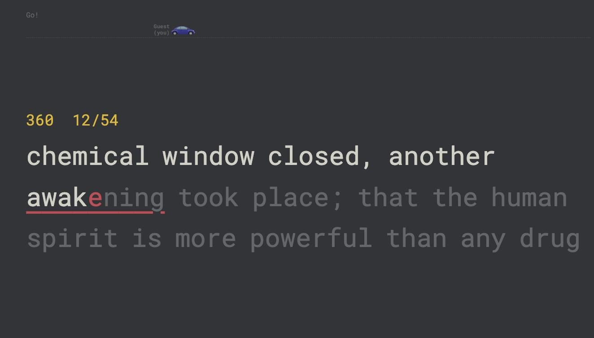

# Monkeytype for TypeRacer

**Type on TypeRacer with the Monkeytype UI.** A free, open source Chrome extension that turns every TypeRacer race into a full-screen, Monkeytype-style typing test: big Roboto Mono text, smooth caret, per-letter colors and the serika dark theme. You still race real people and your results still count.

If you type faster on Monkeytype than on TypeRacer, this is for you.

## Features

- **Monkeytype look and feel on TypeRacer**: serika dark colors, Roboto Mono, large 3-line text that scrolls one line at a time
- **Smooth caret** that blinks when you stop typing
- **Per-letter feedback**: correct, wrong and extra letters colored like Monkeytype, with the current mistake underlined
- **Full-screen race mode**: the typing area takes the whole window, and the race track with cars, names, WPM and countdown sits in a compact strip on top
- **Live WPM and word progress** in Monkeytype yellow
- **Adjustable font size** (default 54px)
- **Stop on letter** mode, like Monkeytype's "stop on error: letter"
- Runs on any race page on play.typeracer.com and picks up each new race automatically
- **Fair play**: your keystrokes go into TypeRacer's own input box. The extension never types for you or sends fake key events. It only changes how the race looks.

## Install

The extension isn't on the Chrome Web Store yet. Install it from source in about a minute:

1. Download this repository: **Code**, then **Download ZIP**, and unzip it, or `git clone https://github.com/ngelkind/typeracer-monkeytype.git`
2. Open `chrome://extensions` and turn on **Developer mode** (top right)
3. Click **Load unpacked** and select the `extension` folder
4. Open [play.typeracer.com](https://play.typeracer.com) and start a race

Other Chromium browsers (Edge, Brave, Opera, Arc) should work the same way.

## Keyboard shortcuts

On Mac, `Alt` is the `Option` key.

| Shortcut | Action |
|---|---|
| `Alt + M` | Turn the Monkeytype skin on or off |
| `Alt + F` | Switch between full-screen mode and the in-page box |
| `Alt + =` / `Alt + -` | Make the text bigger or smaller |
| `Alt + L` | Toggle stop on letter (wrong keys are not entered) |
| any key | Focus the race again after clicking away |

Settings are saved between races.

## FAQ

**Is this cheating?**
No. You type every character yourself into TypeRacer's normal input. The extension only reads the text and draws it differently, the same way a browser theme would.

**Why can't I move past a typo like on Monkeytype?**
TypeRacer won't accept a word until it's typed correctly, and the extension doesn't change race rules. Backspace and fix it, as with Monkeytype's "stop on error: word".

**It doesn't show up on a race.**
Reload the TypeRacer tab after installing or updating the extension, and check that the skin isn't switched off with `Alt + M`.

**Can I change the theme colors?**
Yes. Edit the variables at the top of `extension/monkey.css`, then reload the extension.

## How it works

TypeRacer draws the race text as one element per character and puts your input in a text box. The extension keeps that text box focused but invisible, reads what you type and the race text, and draws a Monkeytype-style view over it. Race logic, WPM, accuracy and results all stay TypeRacer's own.

## Contributing

Issues and pull requests are welcome. If TypeRacer changes its page and the extension breaks, please open an issue.

If this helps you type faster, **give it a ⭐ star** so other typists can find it.

## License

Copyright (C) 2026 [ngelkind](https://github.com/ngelkind)

Licensed under the **GNU Affero General Public License v3.0** ([LICENSE](LICENSE)), with an extra attribution term under section 7(b) ([NOTICE](NOTICE)). In short:

- You can use, study, change and share this project for free
- Any fork or modified version you share, including one offered as an online service, must be open source under the same license
- Forks and derived works must credit the original: **Based on "Monkeytype for TypeRacer" by ngelkind, https://github.com/ngelkind/typeracer-monkeytype**

Roboto Mono is by Christian Robertson, licensed under Apache 2.0. TypeRacer and Monkeytype belong to their respective owners. This is an unofficial fan project and isn't affiliated with either.

---

Keywords: typeracer monkeytype, monkeytype theme for typeracer, typeracer extension, typeracer chrome extension, typeracer dark mode, typeracer themes, typing speed, typing test, wpm, touch typing
